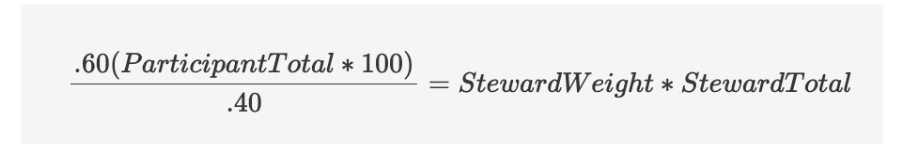

# CB RPGF Раунд 1

Протокол Namada не мог быть создан без общественных благ, а сообщество не было бы таким, каким оно является сейчас, без помощи первых строителей сообщества, объединенных [общей миссией](https://namada.net/vision) использования, обучения и сотрудничества для построения конфиденциальности. Родной токен Namada используется не только для подтверждения доли и управления, но и для [согласования стимулов](https://namada.net/blog/namada-s-positive-sum-economics) сообщества и сети.

Фонд [Anoma Foundation](https://anoma.foundation/) объявил о том, что выделит 10 000 000 собственных токенов Namada в предложении по genesis блоку избранным получателям Namada Community Builder RPGF Round- потенциальным получателем может стать каждый активный участник сообщества Community Builder, начиная с самого начала его истории. Сюда также входят ранние валидаторы, которые участвовали в предыдущих тестовых сетях и оказывали значимую помощь другим валидаторам в получении доступа, решении проблем или поиске решений для предыдущих тестовых сетей.

Если вы заинтересованы в присоединении к сообществу строителей:

1. Заполните эту [форму](https://namada.deform.cc/communitybuilders/)
2. Следите за [@namada](https://twitter.com/namada) в twitter
3. Присоединяйтесь к серверу [Namada Discord](https://discord.gg/namada)
4. Ознакомьтесь с руководством для строителей сообщества.

### Процесс голосования

В этом раунде RPGF ранние управляющие PGF и Community Builders будут использовать Coordinape. Ваше участие в программе Community Builders означает, что вы имеете право голоса в том, что важно и значимо для Namada. По результатам этого голосования будет определено, кто из участников программы Community Builders получит ассигнования на свои усилия и в каком размере. Ранние распорядители PGF проинформируют Фонд Anoma о результатах голосования, чтобы они могли быть включены в предложение по блоку Genesis.

#### Как проходит голосование


<mark style="color:blue;">Помните, чтобы принять участие в голосовании, вы должны быть активным участником сообщества</mark>


1. В рамках процесса включения в сообщество CB добавляются в круг строителей сообщества (CB Circle) на Coordinape ранними стюардами PGF, используя ETH-адрес, указанный в форме
   * Помните: этот ETH-адрес используется **только** для аутентификации вашего доступа к Coordinape.
2. Как только вы станете участником CB Circle на Coordinape, вы сможете начать регистрировать свои вклады в своем профиле. В этот период голосование проводиться не будет.
   * Прежде чем регистрировать вклад, ознакомьтесь с правилами.
   * Бездействие в период внесения вкладов: Может быть проведена переоценка членства в CB (в этот период Вы можете лишиться членства в CB). Однако это происходит, если до начала периода голосования вы не сделали ни одного вклада.
3. Голосование начинается сразу после начала 1-недельной эпохи. В течение этого периода:
   * Каждый участник CB получает фиксированное количество GIVE на Coordinape (они же баллы на платформе). Эта сумма GIVE одинакова для каждого CB.
   * Примечание: если вы не представили ни одной работы в течение Эпохи, вы будете вычеркнуты из круга CB и не будете получать GIVE.
   * У CB будет 1 неделя на то, чтобы распределить свои CB между другими членами CB в соответствии с их вкладами.
   * Параллельно с этим ранние управляющие PGF будут также в течение 1 недели распределять свои GIVE между членами CB.
4. Вес голосов:
   * CB будут иметь 40%, а ранние управляющие PGF - 60% от общего веса голосов.
   * Сумма GIVE, распределяемая между CB и ранними управляющими PGF, будет отражать эти коэффициенты веса голосов.

<figure><figcaption></figcaption></figure>

5. Завершение эпохи голосования:

* По окончании эпохи результаты будут опубликованы.
* По этим результатам будут определены получатели и суммы.
* Ранние распорядители PGF проинформируют Фонд Anoma об окончательных предлагаемых получателях и соответствующих ассигнованиях, которые будут включены в предложение по генезисному блоку.

### Временные рамки

Если вы хотите принять участие в раунде RPGF, то вот даты, которые следует иметь в виду:

1. Те, кто хочет стать строителем сообщества, могут [зарегистрироваться прямо сейчас](https://namada.net/community/docs/community-builder-handbook).
2. **Начиная с четверга, 19 октября 2023 года**, вклады открыты
3. Начнется период вкладов, который продлится примерно **5 недель** - **до воскресенья, 19 ноября 2023 года.**
   * Принятые материалы могут относиться к началу существования сообщества, если вы являетесь его участником
   * К принятым работам также относятся все работы, поданные в течение 5 недель, предшествующих первому периоду голосования
4. По окончании этого периода в воскресенье, 26 ноября, начнется эпоха голосования на Coordinape, которая продлится 1 неделю, до понедельника, **5 декабря 2023 года, в 23:59 UTC.**
   * Последний вклад сообщества может быть подан до среды **28 ноября 2023 г. в 23:59 UTC.** Все заявки, поданные после этой даты, могут быть рассмотрены для будущих потенциальных раундов RPGF, но без гарантии выделения суммы из пула (к этим заявкам будет добавлена другая дата).
5. Итоги и результаты будут опубликованы вскоре после этого. Результаты этого голосования будут использованы для распределения токенов NAM среди участников ранних этапов программы Community Builder, а также для информирования Фонда Anoma об окончательных получателях и соответствующих распределениях, которые будут включены в предложение по блоку генезиса.
6. Получатели этого раунда RPGF должны дождаться инструкций по генерации ключей до начала генезиса.

&#x20;
